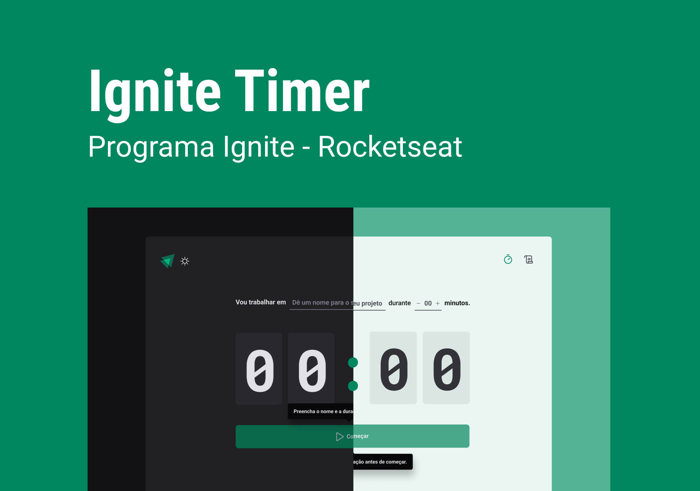

# Ignite Timer

<p align="center">
    
</p>

Segundo projeto desenvolvido na Trilha ReactJS do Ignite.

## Como Executar o Projeto

1.  Clone o repositório:

    ```bash
    git clone [https://github.com/Robson16/ignite-todo.git](https://github.com/Robson16/ignite-todo.git)
    ```

2.  Acesse o diretório do projeto:

    ```bash
    cd ignite-todo
    ```

3.  Instale as dependências:

    ```bash
    npm install
    ```

4.  Inicie o servidor de desenvolvimento:

    ```bash
    npm run dev
    ```

## Layout no Figma

[Acessar Layout no Figma](https://www.figma.com/community/file/1127351821076435124)

## Contribuição

Contribuições são bem-vindas! Sinta-se à vontade para abrir issues e enviar pull requests.

## Licença

Este projeto está sob a licença MIT. Consulte o arquivo [LICENSE](./LICENSE) para mais informações.

### ☕❤

[Robson H. Rodrigues](https://www.linkedin.com/in/robson-h-rodrigues-93341746/)
