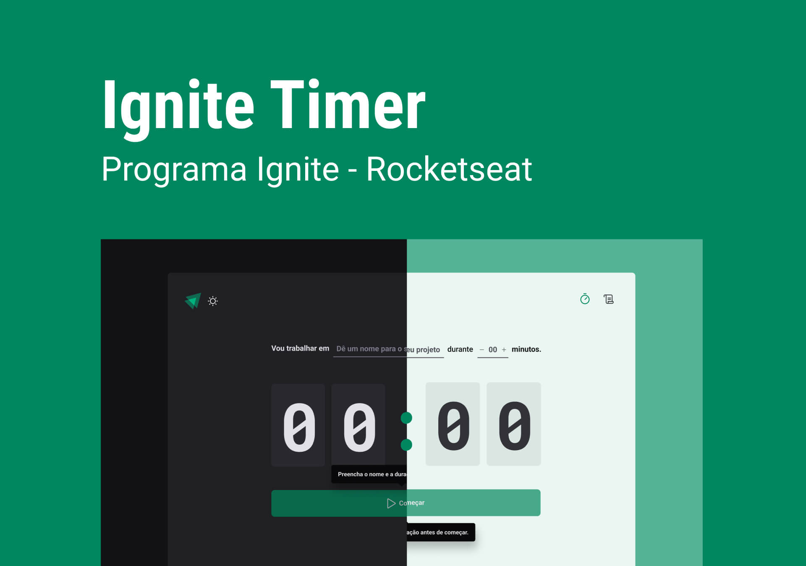

# Ignite Timer

<p align="center">
    
</p>

Este é o segundo projeto desenvolvido durante a Trilha ReactJS do Ignite, focado na criação de um timer personalizado para gerenciamento de tarefas. O objetivo é aplicar conceitos fundamentais do React, como estados, componentes e hooks, além de boas práticas de organização e estilização de aplicações modernas.

## Tecnologias Utilizadas

- **ReactJS** — Biblioteca principal para construção da interface.
- **TypeScript** — Tipagem estática para maior segurança e produtividade.
- **Vite** — Ferramenta de build e desenvolvimento rápido.
- **Styled Components** — Estilização de componentes com CSS-in-JS.
- **React Hook Form** — Gerenciamento de formulários.
- **Zod** — Validação de dados dos formulários.
- **Immer** — Manipulação imutável de estados de forma simples.
- **Date-fns** — Utilitários para manipulação de datas em JavaScript.
- **Phosphor Icons** — Biblioteca de ícones.
- **ESLint & Prettier** — Padronização e qualidade do código.
- **Git & GitHub** — Controle de versão e hospedagem do código.

## Como Executar o Projeto

1.  Clone o repositório:

    ```bash
    git clone https://github.com/Robson16/ignite-timer
    ```

2.  Acesse o diretório do projeto:

    ```bash
    cd ignite-timer
    ```

3.  Instale as dependências:

    ```bash
    npm install
    ```

4.  Inicie o servidor de desenvolvimento:

    ```bash
    npm run dev
    ```

## Demonstração Online

[Acessar Demonstração](https://ignite-timer-blue-gamma.vercel.app/)

## Layout no Figma

[Acessar Layout no Figma](https://www.figma.com/community/file/1127351821076435124)

## Contribuição

Contribuições são bem-vindas! Sinta-se à vontade para abrir issues e enviar pull requests.

## Licença

Este projeto está sob a licença MIT. Consulte o arquivo [LICENSE](./LICENSE) para mais informações.

### ☕❤

[Robson H. Rodrigues](https://www.linkedin.com/in/robson-h-rodrigues-93341746/)
